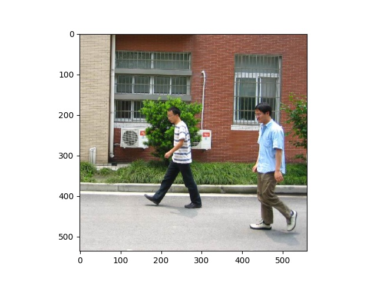
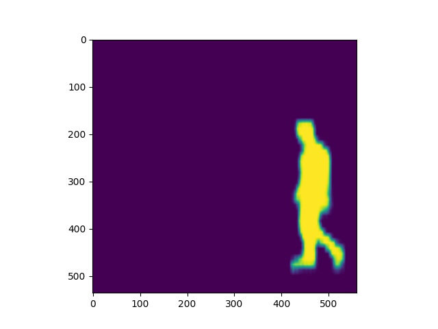
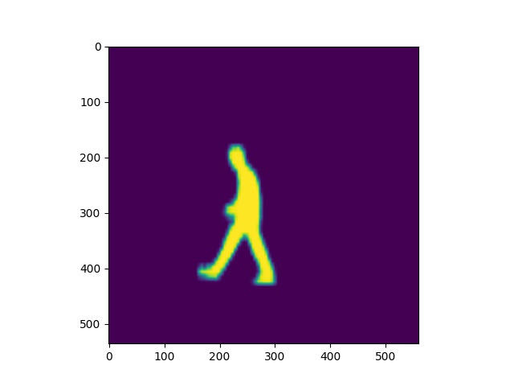
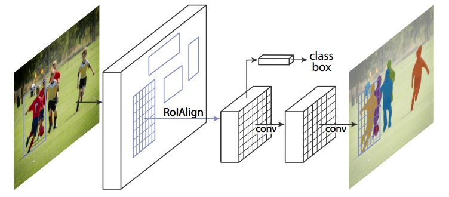
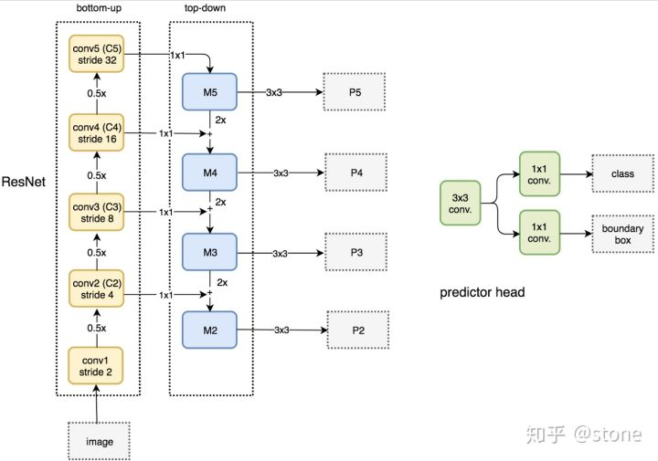
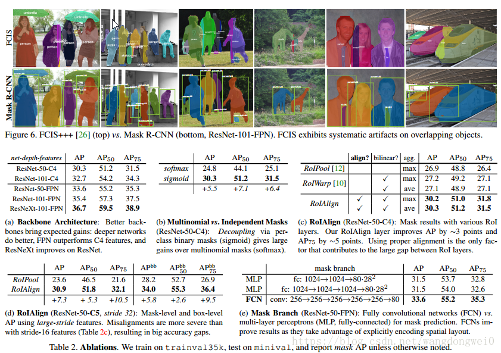
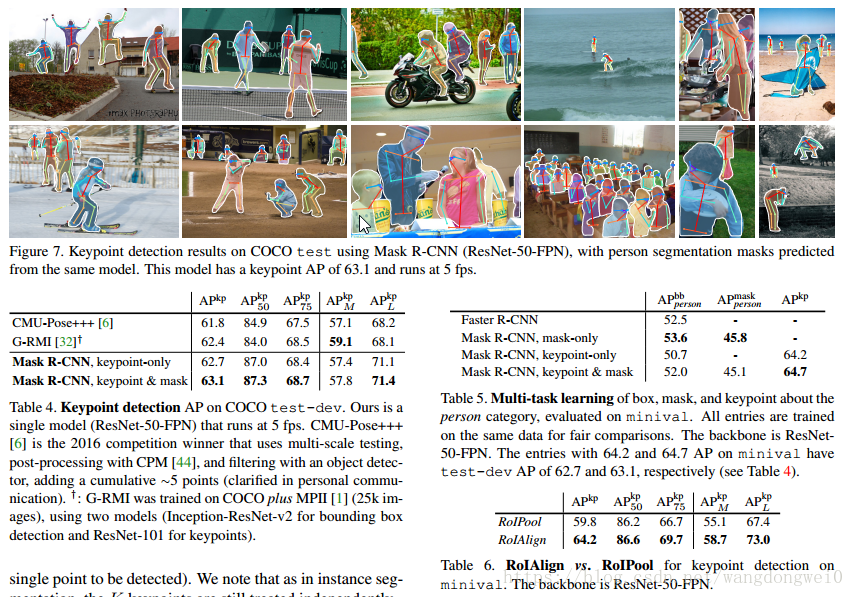

# Mask RCNN Pedestrian Detection

2020.9.22

## visualization

origin -->									output -->

## Mask RCNN Model

### Backbone:  ResNet + FPN

#### FPN

## Compare With Other Net

## Human Pose

Previous sharing: https://github.com/StephenTerror/tf2-mnist-visualization

[readme](./source/readme.md)